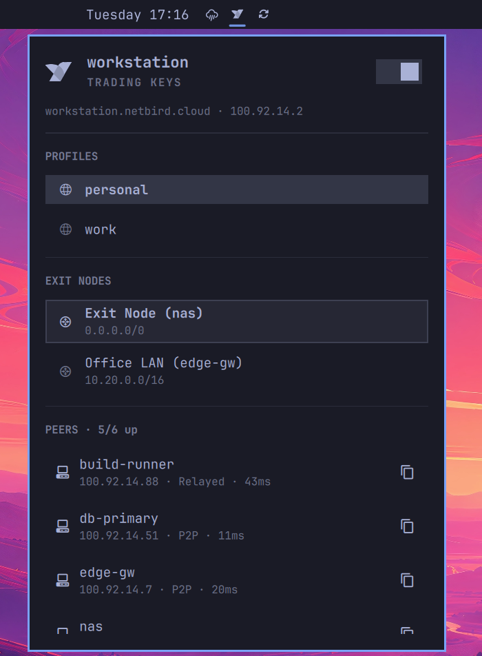

# NetBird for Omarchy

A NetBird bar widget for the [Omarchy](https://omarchy.org/) shell. It mirrors
the built-in Tailscale widget: connection state at a glance, one-click toggling,
peer browsing, exit node selection, and quick copy actions.



## Features

- **Status at a glance** — daemon state, your own peer name and NetBird IP,
  and a connected/total peer count in the bar.
- **Toggle the connection** — bring NetBird up or down from the panel, with an
  optimistic UI so the icon reacts immediately instead of waiting for the next
  status poll.
- **Login handling** — when the daemon reports `NeedsLogin`, the panel surfaces
  the authentication URL that `netbird up` prints.
- **Peer browsing** — every peer with its status, connection type (P2P or
  relayed), and latency. Connected peers sort to the top.
- **Exit nodes and networks** — list advertised networks and select or deselect
  one without leaving the bar.
- **Profile switching** — see available NetBird profiles and switch the active one.
- **Copy actions** — copy a peer's NetBird IP or its short name.
- **SSH into a peer** — open a terminal running `netbird ssh <peer>` straight
  from the peer row. Available for connected peers; if the peer's SSH server is
  disabled, `netbird` reports that in the terminal. The username is remembered
  per peer, since `netbird ssh` otherwise defaults to your local username and
  many peers run a different account.

### Keyboard shortcuts

With the panel open: `t` toggle the connection, `r` refresh, and on the peer
under the cursor `s` SSH, `S` change that peer's SSH username, `c` copy IP,
`n` copy name, `d` copy FQDN.

### SSH usernames

`netbird ssh` connects as your local username unless told otherwise, so a peer
whose account differs fails with `User authentication failed` right after the
SSO login succeeds. The username is therefore resolved as:

1. the username remembered for that peer,
2. the `sshUser` setting,
3. nothing — `netbird` falls back to your local username.

The first time you SSH to a peer, the button asks for the username and
remembers it. Right-click the button (or press `S`) to change it later.
Remembered usernames live in `~/.local/state/omarchy/netbird-ssh-users.json`,
outside the plugin directory, so they survive a plugin update.

## Requirements

- Omarchy with the Omarchy shell (Quickshell) bar.
- The **`netbird`** CLI on `PATH`, plus a running `netbird` daemon.
  On Arch: `omarchy pkg aur add netbird` (or `yay -S netbird`), then
  `sudo systemctl enable --now netbird`.

The widget shells out to the `netbird` binary only. It makes no network
requests of its own, bundles no binaries, and never invokes `sudo` or `pkexec`.
If `netbird` is not installed, the widget reports it and stays inert.

## Installation

```bash
omarchy plugin add https://github.com/nico-kovacs/omarchy-plugin-netbird --enable
```

That clones the plugin into `~/.config/omarchy/plugins/` and adds the widget to
your bar. To install without enabling it immediately, drop `--enable` and then:

```bash
omarchy plugin enable io.github.nico-kovacs.netbird right
```

## Configuration

Configurable from the bar widget settings UI, or in
`~/.config/omarchy/shell.json`:

| Setting | Type | Default | Range | Description |
|---|---|---|---|---|
| `refreshIntervalSec` | integer | `30` | 5–3600 | How often to poll `netbird status` |
| `sshUser` | string | `""` | — | Default SSH username; blank uses your local username |

## Updating

```bash
omarchy plugin update io.github.nico-kovacs.netbird
```

## Removal

```bash
omarchy plugin remove io.github.nico-kovacs.netbird --yes
```

That disables the widget, removes it from your bar layout, and deletes the
plugin directory. To only hide it while keeping it installed:

```bash
omarchy plugin disable io.github.nico-kovacs.netbird
```

## Development

```bash
omarchy plugin validate .
```

`Model.js` holds the parsing logic with no QML imports, so it can be exercised
directly under Node:

```js
const M = require("./Model.js");
M.parseStatus(rawJsonFromNetbirdStatusJson);
```

## License

MIT — see [LICENSE](LICENSE).
